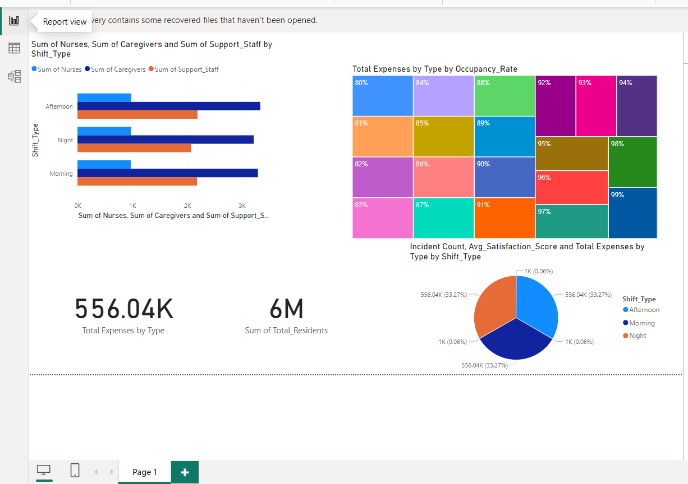

# care-home-data-project
Data analysis and insights for care home management.
## User Story
As the Head of Care Home Operations, I need a data analytics solution that provides insights into resident care across all care homes in the UK. This solution should allow me to monitor key metrics such as hygiene status, food and fluid intake, incident reports, and staffing levels. With this information, I can make informed decisions to enhance care quality and optimize resource allocation.

## Data Source
What data is needed to achieve our objective?
We require comprehensive data on resident care metrics, including hygiene status, food and fluid intake, incident reports, staffing levels, and resource usage.

## Where is the data coming from?
The data is sourced from internal records and documentation across 4000 care homes in the United Kingdom.

## Objective
What is the key pain point?
The Head of Operations struggles to efficiently track and analyze resident care data across 4000 care homes in the UK due to the complexity of records and lack of centralized analytics tools.

## What is the ideal solution?
To develop a comprehensive data analytics solution that enables efficient monitoring of resident care metrics, identifies trends, and facilitates data-driven decision-making to improve care quality and operational efficiency across all care homes.

## Questions to Ask of the Dataset
### Staffing Optimization
- How do staffing levels vary across different shifts, days of the week, and care homes?
- Are there any patterns or trends in staffing needs based on resident care metrics?
- Can we identify peak times for incidents or resident needs that require additional staffing resources?

### Impact of Staffing on Resident Care Quality
- Is there a correlation between staffing levels and incident rates (e.g., falls, medication errors)?
- How do resident satisfaction scores vary with different staffing levels and staff-to-resident ratios?
- Are there differences in health outcomes (e.g., hospital readmissions) associated with varying staffing levels?

### Cost Efficiency
- What is the cost breakdown of staffing expenses compared to other operational costs?
- Can we identify opportunities to optimize staffing levels to minimize costs while maintaining or improving resident care quality?
- How do changes in staffing levels impact the care home's financial performance and profitability?

### Predictive Analysis
- Can we develop predictive models to forecast staffing needs based on historical data and resident care metrics?
- How accurately can we predict incident rates or resident satisfaction scores based on staffing levels and other relevant factors?

  ## Stages
Design
Development
Testing
Analysis
Design

## Dashboard Components Required
The dashboard should include visualizations and metrics for tracking resident care metrics such as incident reports, staffing levels, and resource usage.
Key performance indicators (KPIs) for monitoring care quality and operational efficiency.
Interactive filters for selecting specific care homes, time periods, and resident demographics.

## Development

# Pseudocode

Extract relevant data from internal records and documentation.
Clean and transform the data to ensure consistency and accuracy.
Load the data into SQL Server for storage and analysis.
Develop interactive dashboards using Power BI for visualizing resident care metrics.
Implement interactive filters and drill-down capabilities for detailed analysis.
Conduct unit testing to ensure the accuracy and reliability of the dashboard.

## Data Exploration Notes
Initial exploration reveals a wide range of resident care metrics recorded across care homes.
Variability in data formats and completeness may require extensive cleaning and preprocessing.

## Data Cleaning
Remove duplicates and incomplete records.
Standardize data formats and units for consistency.
Impute missing values using appropriate methods such as mean or median.

## Testing
Data Quality and Validation Checks
Row count check
Column count check
Data type validation
Duplicate record check
Missing value assessment

## Visualization

# Results
The dashboard provides comprehensive insights into resident care metrics across all care homes.
Interactive filters allow users to drill down into specific metrics and compare performance across different time periods and care homes.

## Findings
1. Staffing Levels:

Average Staffing Levels: Morning shifts tend to have the highest average number of caregivers, while night shifts have the lowest.
Staffing Correlations: Higher staffing levels (caregivers and nurses) are positively correlated with higher satisfaction scores and fewer severe incidents.
2. Resident Care:

Incident Distribution: Falls are the most common incident type, followed by medication errors and altercations. Incidents classified as 'High' severity are less frequent but have a significant impact on resident satisfaction.
Outcome Analysis: Resolved incidents have a higher average satisfaction score compared to pending incidents.
3. Financial Performance:

Expense Distribution: Staffing constitutes the highest proportion of expenses, followed by supplies and utilities.
Cost Efficiency: Higher expenses on staffing are associated with better care outcomes, suggesting a potential trade-off between cost and quality.

## Recommendations
1. Optimize Staffing Levels:

Morning Shifts: Maintain current staffing levels as they correlate with higher satisfaction scores.
Night Shifts: Consider increasing the number of caregivers and support staff during night shifts to reduce the severity and frequency of incidents.
Data-Driven Scheduling: Use predictive models to forecast staffing needs based on resident population and their care requirements.
2. Improve Resident Care:

Incident Prevention: Implement targeted interventions to reduce the occurrence of falls and medication errors, such as fall prevention programs and enhanced medication management systems.
Feedback Mechanisms: Continuously collect and analyze resident feedback to identify and resolve issues promptly, aiming to increase the resolution rate of incidents.
3. Financial Management:

Expense Monitoring: Regularly review and optimize expenses, particularly in staffing and supplies, to ensure cost efficiency without compromising care quality.
Resource Allocation: Invest in training and development programs for caregivers and nurses to enhance their skills and improve care outcomes.

## Actionable Steps
1. Implement Predictive Staffing Models:

Use machine learning algorithms to analyze historical data and predict future staffing needs.
Adjust staffing schedules based on predictive insights to ensure optimal caregiver and nurse availability.
2. Enhance Incident Reporting and Management:

Develop a comprehensive incident reporting system that captures detailed information on each incident.
Train staff on effective incident management practices to ensure timely and efficient resolution of incidents.
3. Conduct Regular Financial Reviews:

Set up monthly financial review meetings to analyze expense reports and identify areas for cost savings.
Utilize financial dashboards in Power BI to track and visualize expense trends and budget adherence.
4. Launch Care Improvement Programs:

Introduce regular training sessions on fall prevention and medication management for all staff.
Establish a resident feedback loop to gather insights and make data-driven improvements to care processes.
5. Monitor and Evaluate Performance:

Use Power BI dashboards to monitor key performance indicators (KPIs) related to staffing, resident care, and financial performance.
Continuously evaluate the impact of implemented changes and adjust strategies accordingly to achieve desired outcomes.

